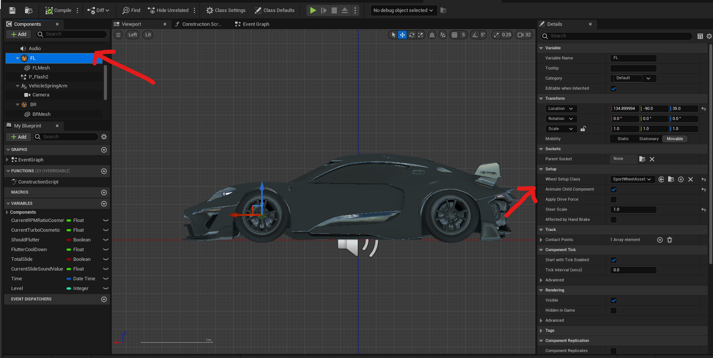
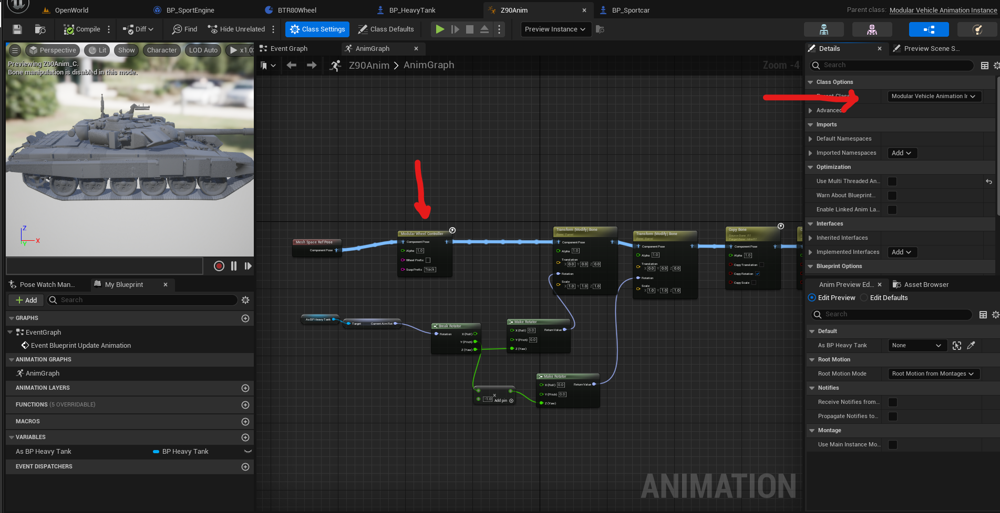
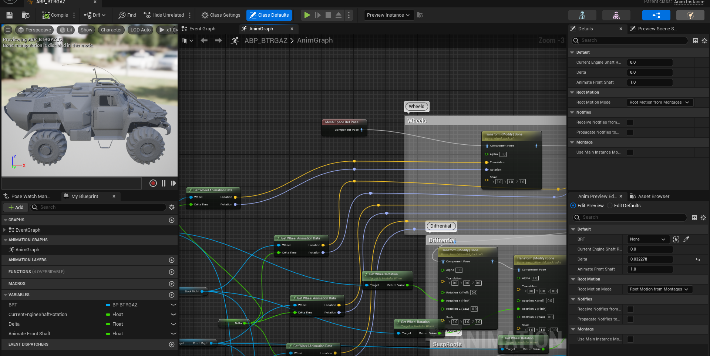

# Animation Guide

In the **Animation Guide** module, we explore various methods to animate wheels in your vehicle simulation using the Modular Movement plugin. Animation adds visual realism and dynamic movement to your vehicles, enhancing the overall immersive experience for your players. This guide presents multiple approaches to achieve wheel animation, allowing you to choose the one that best suits your project's requirements and assets.

## Static Mesh

Animating wheels using static mesh components is a straightforward approach. By enabling the "Animate Child Component" option on the wheel component, you can attach your static mesh wheels directly to the wheel component. This method is suitable for vehicles with wheels represented by separate static mesh assets.

## Wheels as Part of Root Skeletal Mesh

For vehicles where the wheels are integrated into the root skeletal mesh, a more sophisticated approach is needed. You can create an Animation Blueprint (Anim BP) that is a child of the Modular Vehicle Animation Instance. Within the Anim BP, utilize the "Modular Wheel Controller" node to control the wheel animations. The bone names are automatically determined based on the wheel component names, such as "R1 Component" corresponding to "R1 Bone." Additionally, you can provide a prefix for suspension bones, enhancing control over suspension animations.

## Custom Animation Methods

If you have specific requirements or wish to implement custom wheel animations, the plugin provides you with the flexibility to do so. Utilize the "Get Wheel Animation Data" function to access relative space wheel animation data. With this data, you can employ various techniques, such as manipulating skeletal mesh bones or using transform nodes to animate the wheels or suspension components in a custom manner.

Example project vehicle BRTGAZ has is an example of a semi realistic suspension with siumalted susp control arms and differential.

