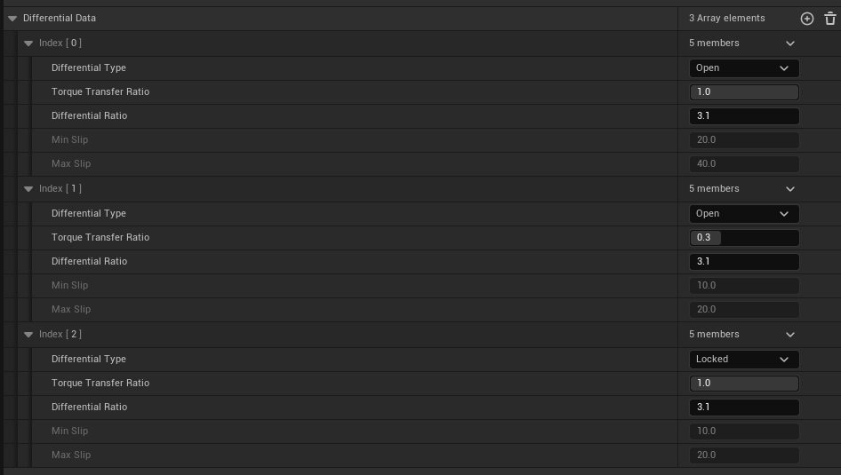
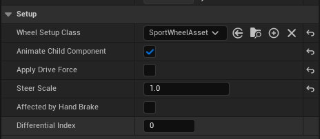

# Differential Configuration in Vehicle Data Blueprint

## Overview

In vehicle data blueprints, you have the flexibility to define an array of differential configurations to suit your specific needs. This allows for precise control over how power is distributed among the wheels of the vehicle.

## Defining Differential Configurations

To set up differential configurations, follow these steps:

1. Define the array of differential configurations in the vehicle data blueprint.
2. Assign wheels to these differentials by selecting the wheel component and setting the corresponding differential index.

## Moving Wheels Between Differentials

If necessary, you can move wheels between differentials using the `SetActiveDifferentialIndex` function.  

Only wheels that have ApplyDriveForce proprety enabled will be registered with differential.

## Modular Movements and Configuration Limitations

- Modular movements support up to 255 differential configurations per vehicle.
- Differentials can have different gear ratios (e.g., High or Low ratios).
- However, it's crucial to ensure that two active differentials do not have mismatching gear ratios.

## Configuring Power Split

When configuring the power split among differentials:

- Ensure that the power split ratios add up to 1 in total when active.
- This ensures optimal power distribution and vehicle performance.
