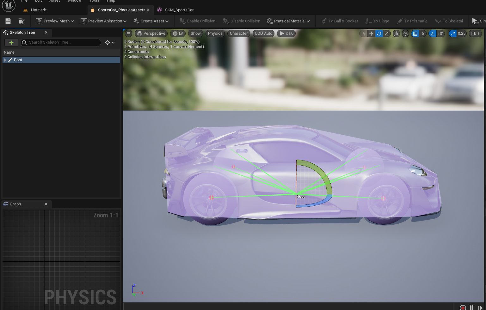

# Getting Started

Below is two examples of general use cases for Modular Movement Plugin. However use cases are not limited to ones mentioned below, If you are intreseted in other use cases please download the example project provided!

``` Note: Realistic tire models require physics substepping option to be enabled in project settings to work accurately.```

 strongly recommend that you download our sample project, available at https://github.com/irajsb/ModularVehicles, to understand what is possible with this plugin.
  

## Skeletal Mesh vehicle Setup

>  Note: Make sure that your vehicle physics asset (for example
> SportsCar_PhysicsAsset in case of default vehicle) Has a correct
> collision at its root bone. Wheels Should not have collisions
> 
> Events LookX Looky And Forward in the example video are project specific way of handling
> input done using Input mappings section in project settings or using
> the new Enhanced Input system.
> Feel free to implement the input relative to your project requirements.



  

### Video:

  

<iframe  width="900"  height="600"  src="https://www.youtube.com/embed/7pHzA1hzgUA"  frameborder="0"  allow="accelerometer; autoplay; encrypted-media; gyroscope; picture-in-picture"  allowfullscreen></iframe>

  


  

<iframe  width="900"  height="600"  src="https://www.youtube.com/embed/plc3qmWk18s"  frameborder="0"  allow="accelerometer; autoplay; encrypted-media; gyroscope; picture-in-picture"  allowfullscreen></iframe>
