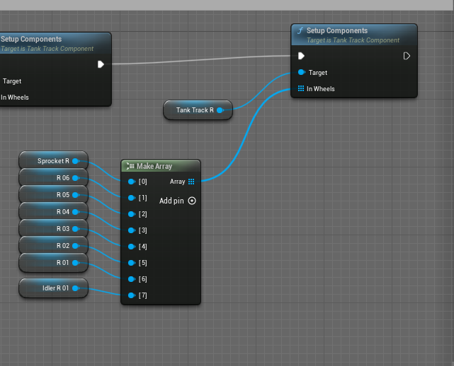

# Comprehensive Documentation: 12 Tank Pack

## Controls

- **WASD**: Control the movement of the tank.
 - W: Move forward
 - S: Move backward
 - A: Rotate left
 - D: Rotate right
- **Mouse**: Look around and aim the turret.
- **Left Mouse Button**: Fire the main weapon.
- **Right Mouse Button**: Zoom in/out the camera view.
- **G**: Deploy smoke grenades (available on some tank models).
- **F**: Fire secondary weapons, such as rockets (available on some tank models).
- **H**: Toggle the tank's headlights on/off.

## Tracks

The tank tracks are created using the `TankTrack Component`, which accepts a list of trackable components. The two types of acceptable trackable components are wheel components and idler components.

To set up a track, follow these steps:

1. Start from the sprocket (an idler component).
2. Loop around the wheels and idlers, passing these components to the `SetupComponent` function of the `TankTrack` component.

Each wheel or idler can have multiple contact points, represented by a `Vector2D` number that indicates where the track should contact the wheel/idler relative to its surface. For example:

- `(0, 1)` represents the top of the wheel.
- `(-1, 0)` represents the left side of the wheel.

The track system supports track sway (tension). To enable this feature, you can add idlers or contact points where the track should be loose, move them down slightly, and increase the `MaxSway` parameter. This way, the sway parts of the track will move up or down based on the track length and suspension dynamics.

## Weapon

You can customize the following weapon properties in the `VehicleComponent`:

- **Weapon Rotation Speed**: Adjust the speed at which the turret rotates.(Note: Rocket launcher and turret should have same rotation speed in order to aim correctly).
- **Reload Speed**: Modify the rate at which the main weapon can be reloaded and fired again.
- **Projectile Speed**: Change the velocity at which the projectiles travel.

## Material

The tank material system supports the following features:

- **Camouflage Pattern Change**: Modify the camouflage pattern applied to the tank's exterior.
- **Roughness**: Adjust the roughness of the material, affecting how it reflects light and appears visually.
- **Dirt**: Apply a dirt overlay to the tank's material, simulating accumulated grime and wear.
- **Rust**: A texture for edge wears, simulating rust and corrosion.
- **Camo Scale**: The RG channels represent the X and Y scales of the camouflage pattern.
- **Normal Flatness**: A value between 0 and 1 that controls how smooth the normal map appears. Higher values make the normal map smoother.
- **Scratch Scale 1 and 2**: Used to add two sizes of scratches to the paint, simulating wear and damage.

## Smoke Launchers

Smoke launchers can be customized in terms of direction and timing. The logic for smoke launchers is implemented in the `Base_BP Tank` blueprint.

Additionally, the cone radius of the smoke launchers can be customized in each tank's default details panel.

## How to Apply Damage

To apply damage to tanks, you can use the hit events of rockets or projectiles. Here's how you can implement damage:

1. In the hit event of a rocket or projectile, Use apply damage function, You can react to this damage in Base Tank blueprints in AnyDamage event.
2. For added realism, you can also apply physical impulse to the tank when it takes damage. This will create a force that pushes the tank back, simulating the impact of the projectile or explosion.

By applying physical impulse, you can create more dynamic and realistic damage effects.